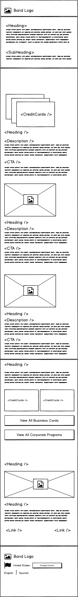

# AMP Workshop Project

#### Last Updated 05/22/2018

#### Local development
`npm run dev`

### Website
- [View website](https://still-crag-63043.herokuapp.com/)

### Tools
- [Online Validator](https://validator.ampproject.org/)

### Mocks

#### Stage-0

### Resources
- [amp by example](https://ampbyexample.com/)
- [spec](https://www.ampproject.org/docs/fundamentals/spec#html-tags)

### Others
- [gulp-uncss](https://github.com/ben-eb/gulp-uncss)
- [gulp-inline-css](https://github.com/jonkemp/gulp-inline-css)
